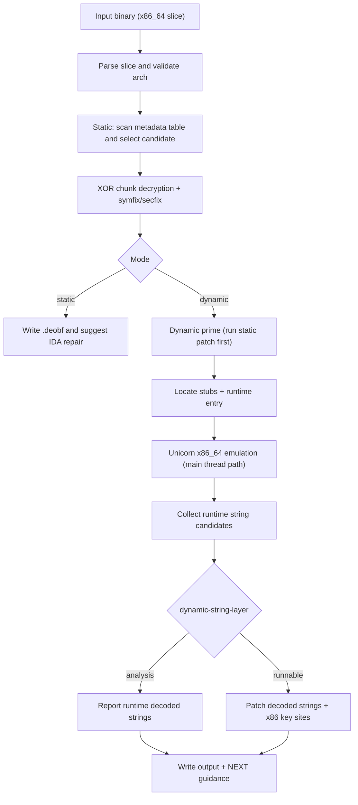
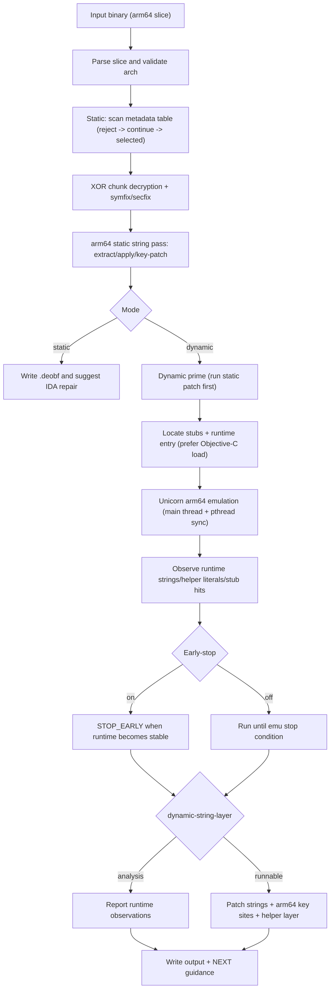

# TNT Mach-O Deobfuscator (Python) 🛠️

[](LICENSE)

🌐 Language: **English** | [中文](README.zh-CN.md)

A static + dynamic deobfuscation tool for Mach-O binaries, suitable for security auditing and reverse-engineering research.

📄 License: **MIT** (see [LICENSE](LICENSE))

## ✨ Features

- ✅ Supports `x86_64` and `arm64`
- ✅ Supports thin Mach-O 64-bit
- ✅ Supports fat Mach-O (with architecture filtering)
- ✅ Static XOR range deobfuscation with boundary checks
- ✅ Dynamic Unicorn-based emulation + memory dump
- ✅ Symbol string restoration (`lazy bind + symtab`)
- ✅ Common section/segment name repair

## 🚀 Installation

Install from GitHub ZIP:

```bash
pip install https://github.com/fjh658/tnt_deobfuscator/archive/refs/heads/main.zip
```

Or local editable install:

```bash
pip install -e .
```

During install, the IDA plugin is deployed automatically:

- macOS / Linux: `~/.idapro/plugins/tnt_deobfuscator_ida.py`
- Windows: `%APPDATA%\\Hex-Rays\\IDA Pro\\plugins\\tnt_deobfuscator_ida.py`
- Windows fallback: `%APPDATA%\\IDA Pro\\plugins\\tnt_deobfuscator_ida.py`
- Final fallback (all platforms): `~/.idapro/plugins/tnt_deobfuscator_ida.py`
- Supported IDA version: **8.3+**
- Auto-deployed on install; manual reinstall/remove is available via `--install` / `--uninstall`.
- Install tries a symlink first (for easier cleanup), then falls back to file copy.

In IDA, the plugin now supports actions:

- `repair`: repair current IDB (recommended after loading `*.deobf`)
- `deobfuscate`: run external CLI only
- `both`: run CLI, then repair current IDB

IDA plugin usage example:


## 🧪 CLI Usage

Default behavior: `static` can be omitted.  
`tnt-deobfuscator -i <input_binary>` is equivalent to `tnt-deobfuscator static -i <input_binary>`.

```bash
tnt-deobfuscator -i <input_binary> -o <output_binary>
```

Underscore alias is also available:

```bash
tnt_deobfuscator -i <input_binary> -o <output_binary>
```

Examples:

```bash
tnt-deobfuscator static -i <input_binary> -o <output_binary> --arch all
tnt-deobfuscator static -i <input_binary> -o <output_binary> --arch x86_64
tnt-deobfuscator static -i <input_binary> -o <output_binary> --arch arm64
tnt-deobfuscator dynamic -i <input_binary> -o <output_binary>
tnt-deobfuscator dynamic -i <input_binary> -o <output_binary> --emu-timeout-ms 30000 --emu-max-insn 2000000
tnt-deobfuscator dynamic -i <input_binary> -o <output_binary> --dynamic-string-layer none
tnt-deobfuscator dynamic -i <input_binary> -o <output_binary> --dynamic-string-layer analysis
tnt-deobfuscator dynamic -i <input_binary> -o <output_binary> --dynamic-string-layer runnable
tnt-deobfuscator dynamic -i <input_binary> -o <output_binary> --arch arm64 --dynamic-string-layer analysis --arm64-disable-early-stop --verbose
tnt-deobfuscator -i <input_binary> -o <output_binary>   # default static
tnt-deobfuscator -i <input_binary> --verbose
tnt-deobfuscator -i <input_binary> --force-reprocess
tnt-deobfuscator --install
tnt-deobfuscator --uninstall
tnt-deobfuscator --install-ida-plugin
tnt-deobfuscator --uninstall-ida-plugin
```

If `-o` is omitted, output defaults to `<input>.deobf`.
Without subcommand, `tnt-deobfuscator -i ...` runs stage-1 `static` mode by default.
`--install` / `--uninstall` are future-proof integration entrypoints; currently they manage IDA plugin install/uninstall.
`--install-ida-plugin` / `--uninstall-ida-plugin` are explicit plugin-only forms.

## 📚 Parameter-by-Parameter Examples

Common options (`static` and `dynamic`):

1. `-i/--input` (required)
```bash
tnt-deobfuscator static -i app.dylib
```
2. `-o/--output` (optional, default `<input>.deobf`)
```bash
tnt-deobfuscator static -i app.dylib -o app.clean.dylib
```
3. `--arch all` (default; patch all supported slices)
```bash
tnt-deobfuscator static -i app.dylib --arch all
```
4. `--arch x86_64` (patch x86_64 slice only)
```bash
tnt-deobfuscator static -i app.dylib --arch x86_64
```
5. `--arch arm64` (patch arm64 slice only)
```bash
tnt-deobfuscator static -i app.dylib --arch arm64
```
6. `--verbose` (show diagnostics and candidate rejection reasons)
```bash
tnt-deobfuscator static -i app.dylib --verbose
```
7. `--force-reprocess` (allow running stage-1 again on files that look already processed)
```bash
tnt-deobfuscator static -i app.dylib.deobf --force-reprocess
```

Dynamic-only options (`dynamic` subcommand):

1. `--emu-timeout-ms` (default `30000`; `0` means unlimited)
```bash
tnt-deobfuscator dynamic -i app.dylib --emu-timeout-ms 60000
tnt-deobfuscator dynamic -i app.dylib --emu-timeout-ms 0
```
2. `--emu-max-insn` (default `2000000`; `0` means unlimited)
```bash
tnt-deobfuscator dynamic -i app.dylib --emu-max-insn 4000000
tnt-deobfuscator dynamic -i app.dylib --emu-max-insn 0
```
3. `--dynamic-string-layer none` (disable runtime string extraction/reporting; keeps dynamic code overlay behavior)
```bash
tnt-deobfuscator dynamic -i app.dylib --dynamic-string-layer none
```
4. `--dynamic-string-layer analysis` (default; extract/report runtime decoded strings without string-byte patching)
```bash
tnt-deobfuscator dynamic -i app.dylib --dynamic-string-layer analysis
```
5. `--dynamic-string-layer runnable` (patch decoded string bytes + matching key sites)
```bash
tnt-deobfuscator dynamic -i app.dylib --dynamic-string-layer runnable
```
6. `--arm64-disable-early-stop` (arm64-only; disable arm64 early-stop heuristic for deeper runtime coverage; may run significantly longer)
```bash
tnt-deobfuscator dynamic -i app.dylib --arch arm64 --dynamic-string-layer analysis --arm64-disable-early-stop --verbose
```
7. Full dynamic run example
```bash
tnt-deobfuscator dynamic -i app.dylib -o app.dynamic.deobf --arch arm64 --emu-timeout-ms 45000 --emu-max-insn 3000000 --dynamic-string-layer runnable --verbose
```

Integration management options:

1. `--install` (install all integrations; currently IDA plugin)
```bash
tnt-deobfuscator --install
```
2. `--uninstall` (remove all integrations; currently IDA plugin)
```bash
tnt-deobfuscator --uninstall
```
3. `--install-ida-plugin` (install plugin only)
```bash
tnt-deobfuscator --install-ida-plugin
```
4. `--uninstall-ida-plugin` (remove plugin only)
```bash
tnt-deobfuscator --uninstall-ida-plugin
```

## 🧠 Mode Semantics

- `static`: performs metadata-driven static recovery (XOR chunk decryption), then repairs symbol strings and section/segment names.
- `dynamic`: first tries static prime, then emulates runtime entry with Unicorn and applies observed memory modifications.
- `--dynamic-string-layer` is only meaningful in `dynamic` mode.
- `--arm64-disable-early-stop` is only meaningful in `dynamic` + `arm64`; it disables arm64 early-stop and favors deeper coverage over speed.
- In `dynamic` + `arm64`, when default limits are used, runtime budget is auto-tuned to `180000ms` and `50000000` instructions.

## 🗺️ Processing Flowcharts

### x86_64



### arm64



## 🧭 Two-Stage Workflow

1. Stage 1 (`static` or `dynamic`): `tnt-deobfuscator static -i <input_binary> -o <input_binary>.deobf`
2. Stage 2 (`repair`): open `*.deobf` in IDA and run plugin action `repair`

Safety policy:

- Stage 1 never overwrites the input file (output must differ from input).
- Stage 2 modifies IDB metadata only; on-disk binary bytes are not patched.

## 🧩 IDA Plugin Environment Variables

- `TNT_IDA_PLUGIN_DIR`: force plugin install directory (custom/testing)
- `TNT_IDA_PLUGIN_LINK_MODE`: plugin install strategy (`auto` / `symlink` / `copy`, default: `auto`)
- `TNT_DEOBF_SKIP_IDA_PLUGIN_INSTALL=1`: skip plugin auto-install
- `TNT_DEOBF_ACTION`: default plugin action (`repair` / `deobfuscate` / `both`)
- `TNT_DEOBF_MODE`: default plugin mode (`static` / `dynamic`)
- `TNT_DEOBF_ARCH`: default plugin arch (`all` / `x86_64` / `arm64`)
- `TNT_DEOBF_DYNAMIC_ARGS`: dynamic-mode extra args (e.g. `--emu-timeout-ms 30000 --emu-max-insn 2000000`)
- `TNT_DEOBF_FORCE_REPROCESS=1`: bypass plugin first-stage reprocess warning
- `TNT_DEOBF_FORCE_REPAIR=1`: bypass plugin second-stage (repair) repeat warning
- `TNT_DEOBF_REPAIR_PROFILE`: repair behavior profile (`auto` / `analysis` / `runnable`)
  - `analysis`: comment-based string restoration only (no string type creation)
  - `runnable`: keep existing repair behavior (including string type creation when matched)
  - `auto` (default): infer from filename (`*.analysis*` -> analysis, `*.runnable*` -> runnable)
  - `__*` literals (for example `__TEXT`, `__DATA`, `__LINKEDIT`) are treated as Mach-O style literals in naming/annotation (`macho` group), not generic env-style literals.
- `TNT_DEOBF_NO_ACTION_PROMPT=1`: skip action prompt and use `TNT_DEOBF_ACTION`
- `TNT_DEOBF_NO_MODE_PROMPT=1`: skip mode prompt and use `TNT_DEOBF_MODE`
- `TNT_DEOBF_NO_ARCH_PROMPT=1`: skip arch prompt and use `TNT_DEOBF_ARCH` (or IDA processor auto-detection)
- `TNT_DEOBF_NO_DYNAMIC_PROMPT=1`: skip dynamic args prompt
- By default, plugin prompts for `action/mode/arch` use readonly dropdowns (non-editable).
- `TNT_DEOBF_CLI`: override CLI command/path used by the plugin
- `TNT_DEOBF_ARGS`: append global extra CLI args
- `TNT_DEOBF_TIMEOUT_SEC`: optional plugin-side timeout (seconds) for external CLI invocation

Environment variable examples:

1. Install plugin to a custom path
```bash
TNT_IDA_PLUGIN_DIR=/tmp/ida_plugins tnt-deobfuscator --install-ida-plugin
```
2. Force plugin install style to symlink/copy
```bash
TNT_IDA_PLUGIN_LINK_MODE=symlink tnt-deobfuscator --install-ida-plugin
TNT_IDA_PLUGIN_LINK_MODE=copy tnt-deobfuscator --install-ida-plugin
```
3. Skip auto plugin deployment during pip install
```bash
TNT_DEOBF_SKIP_IDA_PLUGIN_INSTALL=1 pip install -e .
```
4. Make plugin run non-interactive dynamic deobfuscation by default
```bash
export TNT_DEOBF_ACTION=deobfuscate
export TNT_DEOBF_MODE=dynamic
export TNT_DEOBF_ARCH=arm64
export TNT_DEOBF_DYNAMIC_ARGS="--emu-timeout-ms 60000 --emu-max-insn 3000000 --dynamic-string-layer runnable"
export TNT_DEOBF_NO_ACTION_PROMPT=1
export TNT_DEOBF_NO_MODE_PROMPT=1
export TNT_DEOBF_NO_ARCH_PROMPT=1
export TNT_DEOBF_NO_DYNAMIC_PROMPT=1
```

## 📝 Notes

- The tool scans obfuscation metadata after `mach_header_64 + sizeofcmds`.
- Each `(start, size)` chunk is XOR-restored using a computed key.
- Symbol restoration uses a safe replacement policy to avoid overwriting adjacent string slots.
- Dynamic mode requires Unicorn (included in normal install dependencies). If installed with `--no-deps`, run `pip install unicorn`.
- In verbose static logs, `reject table@...` lines mean invalid candidates were skipped; scanning continues until a valid table is selected.
- Dynamic string layer options (default: `analysis`):
- `none`: disable dynamic string handling.
- `analysis`: extract/report runtime-decoded strings without patching file semantics.
- `runnable`: decode string bytes and patch matching decode-key sites together.
- `none` and `analysis` keep the same output-file semantics for string bytes (no string-byte patching). The practical difference is reporting/extraction visibility and runtime cost.
- Runtime string handling no longer skips `__*` literals by default (applies to both `analysis` reporting and `runnable` patch path).
- Protection-hook stub selection is arch-aware: `x86_64` prefers `_mprotect` (fallback `_vm_protect`), `arm64` prefers `_vm_protect` (fallback `_mprotect`).
- Dynamic summary prints resolved stub symbols, e.g. `mprotect_stub=0x...(_mprotect)` and `dyld_stub=0x...(__dyld_get_image_vmaddr_slide)`.
- In IDA plugin, canceling the `Output file` dialog aborts the full `deobfuscate/both` action (no fallback write path).

## 📄 License

Licensed under the MIT License. See `LICENSE`.
