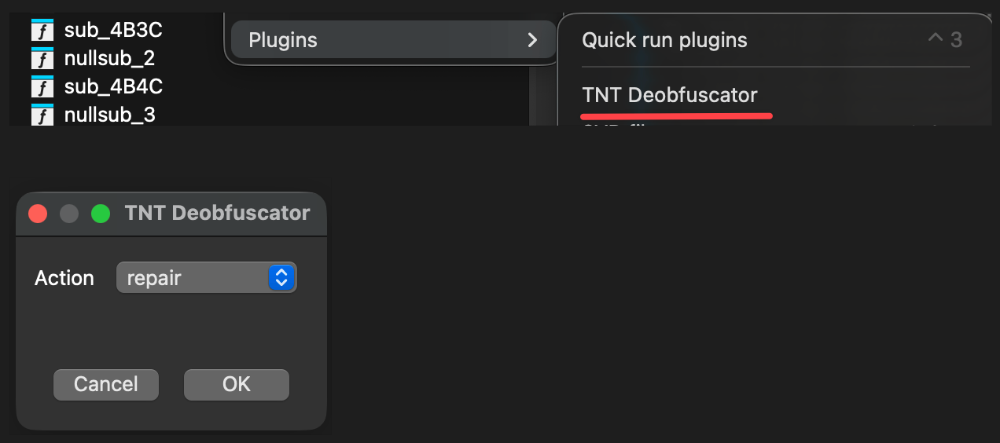
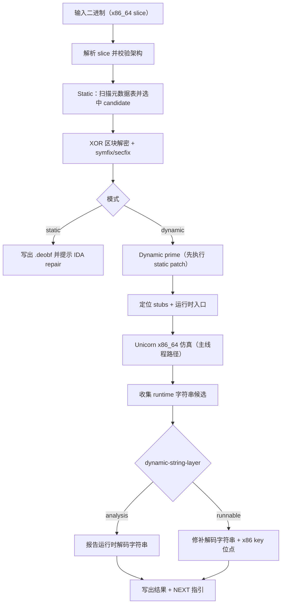
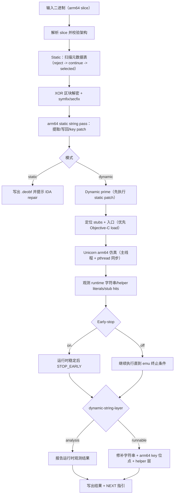

# TNT Mach-O 反混淆工具 (Python) 🛠️

[](LICENSE)

🌐 语言: [English](README.md) | **中文**

一个面向 Mach-O 的静态 + 动态反混淆工具，适用于安全审计与逆向分析研究。

📄 许可证：**MIT**（见 [LICENSE](LICENSE)）

## ✨ 功能特性

- ✅ 支持 `x86_64` 和 `arm64`
- ✅ 支持 thin Mach-O 64-bit
- ✅ 支持 fat Mach-O（可按架构过滤）
- ✅ 支持静态 XOR 区段反混淆，并带边界检查
- ✅ 支持基于 Unicorn 的动态执行 + 内存转储
- ✅ 支持符号字符串恢复（`lazy bind + symtab`）
- ✅ 支持常见 section/segment 名称修复

## 🚀 安装

通过 GitHub ZIP 安装：

```bash
pip install https://github.com/fjh658/tnt_deobfuscator/archive/refs/heads/main.zip
```

或本地可编辑安装：

```bash
pip install -e .
```

安装时会自动部署 IDA 插件：

- macOS / Linux: `~/.idapro/plugins/tnt_deobfuscator_ida.py`
- Windows: `%APPDATA%\\Hex-Rays\\IDA Pro\\plugins\\tnt_deobfuscator_ida.py`
- Windows 兜底目录: `%APPDATA%\\IDA Pro\\plugins\\tnt_deobfuscator_ida.py`
- 最终兜底（全平台）: `~/.idapro/plugins/tnt_deobfuscator_ida.py`
- 支持的 IDA 版本：**8.3+**
- 安装时会自动部署；也可通过 `--install` / `--uninstall` 手动重装或清理。
- 安装时会优先尝试符号链接（便于清理），失败则自动回退为复制文件。

在 IDA 中，插件现在支持以下动作：

- `repair`：修复当前 IDB（推荐在加载 `*.deobf` 后执行）
- `deobfuscate`：仅调用外部 CLI
- `both`：先跑 CLI，再修复当前 IDB

IDA 插件使用示意图：


## 🧪 命令行用法

默认行为：`static` 可以省略。  
`tnt-deobfuscator -i <input_binary>` 等价于 `tnt-deobfuscator static -i <input_binary>`。

```bash
tnt-deobfuscator -i <input_binary> -o <output_binary>
```

也支持下划线命令别名：

```bash
tnt_deobfuscator -i <input_binary> -o <output_binary>
```

示例：

```bash
tnt-deobfuscator static -i <input_binary> -o <output_binary> --arch all
tnt-deobfuscator static -i <input_binary> -o <output_binary> --arch x86_64
tnt-deobfuscator static -i <input_binary> -o <output_binary> --arch arm64
tnt-deobfuscator dynamic -i <input_binary> -o <output_binary>
tnt-deobfuscator dynamic -i <input_binary> -o <output_binary> --emu-timeout-ms 30000 --emu-max-insn 2000000
tnt-deobfuscator dynamic -i <input_binary> -o <output_binary> --dynamic-string-layer none
tnt-deobfuscator dynamic -i <input_binary> -o <output_binary> --dynamic-string-layer analysis
tnt-deobfuscator dynamic -i <input_binary> -o <output_binary> --dynamic-string-layer runnable
tnt-deobfuscator dynamic -i <input_binary> -o <output_binary> --arch arm64 --dynamic-string-layer analysis --arm64-disable-early-stop --verbose
tnt-deobfuscator -i <input_binary> -o <output_binary>   # 默认 static
tnt-deobfuscator -i <input_binary> --verbose
tnt-deobfuscator -i <input_binary> --force-reprocess
tnt-deobfuscator --install
tnt-deobfuscator --uninstall
tnt-deobfuscator --install-ida-plugin
tnt-deobfuscator --uninstall-ida-plugin
```

如果不传 `-o`，默认输出为 `<input>.deobf`。
不带子命令时，`tnt-deobfuscator -i ...` 默认执行第一阶段 `static`。
`--install` / `--uninstall` 是面向后续扩展的集成入口；当前会管理 IDA 插件安装/卸载。
`--install-ida-plugin` / `--uninstall-ida-plugin` 是更明确的插件专用形式。

## 📚 参数级示例

通用参数（`static` 与 `dynamic` 都可用）：

1. `-i/--input`（必填）
```bash
tnt-deobfuscator static -i app.dylib
```
2. `-o/--output`（可选，默认 `<input>.deobf`）
```bash
tnt-deobfuscator static -i app.dylib -o app.clean.dylib
```
3. `--arch all`（默认；处理所有支持架构切片）
```bash
tnt-deobfuscator static -i app.dylib --arch all
```
4. `--arch x86_64`（仅处理 x86_64 切片）
```bash
tnt-deobfuscator static -i app.dylib --arch x86_64
```
5. `--arch arm64`（仅处理 arm64 切片）
```bash
tnt-deobfuscator static -i app.dylib --arch arm64
```
6. `--verbose`（输出详细诊断日志）
```bash
tnt-deobfuscator static -i app.dylib --verbose
```
7. `--force-reprocess`（允许对看起来已处理过的文件再次执行第一阶段）
```bash
tnt-deobfuscator static -i app.dylib.deobf --force-reprocess
```

仅 `dynamic` 子命令可用参数：

1. `--emu-timeout-ms`（默认 `30000`；`0` 表示不限时）
```bash
tnt-deobfuscator dynamic -i app.dylib --emu-timeout-ms 60000
tnt-deobfuscator dynamic -i app.dylib --emu-timeout-ms 0
```
2. `--emu-max-insn`（默认 `2000000`；`0` 表示不限制指令数）
```bash
tnt-deobfuscator dynamic -i app.dylib --emu-max-insn 4000000
tnt-deobfuscator dynamic -i app.dylib --emu-max-insn 0
```
3. `--dynamic-string-layer none`（关闭运行时字符串提取/报告；保留 dynamic 代码 overlay 行为）
```bash
tnt-deobfuscator dynamic -i app.dylib --dynamic-string-layer none
```
4. `--dynamic-string-layer analysis`（默认；提取/报告运行时解码字符串，但不做字符串字节修补）
```bash
tnt-deobfuscator dynamic -i app.dylib --dynamic-string-layer analysis
```
5. `--dynamic-string-layer runnable`（修补字符串字节并联动修复 key 位点）
```bash
tnt-deobfuscator dynamic -i app.dylib --dynamic-string-layer runnable
```
6. `--arm64-disable-early-stop`（仅 arm64；关闭 arm64 early-stop 启发式，覆盖率更深但运行时间可能显著增加）
```bash
tnt-deobfuscator dynamic -i app.dylib --arch arm64 --dynamic-string-layer analysis --arm64-disable-early-stop --verbose
```
7. 完整 dynamic 组合示例
```bash
tnt-deobfuscator dynamic -i app.dylib -o app.dynamic.deobf --arch arm64 --emu-timeout-ms 45000 --emu-max-insn 3000000 --dynamic-string-layer runnable --verbose
```

安装/卸载管理参数：

1. `--install`（安装全部集成项；当前为 IDA 插件）
```bash
tnt-deobfuscator --install
```
2. `--uninstall`（卸载全部集成项；当前为 IDA 插件）
```bash
tnt-deobfuscator --uninstall
```
3. `--install-ida-plugin`（仅安装 IDA 插件）
```bash
tnt-deobfuscator --install-ida-plugin
```
4. `--uninstall-ida-plugin`（仅卸载 IDA 插件）
```bash
tnt-deobfuscator --uninstall-ida-plugin
```

## 🧠 模式语义

- `static`：按文件中的混淆元数据执行静态还原（XOR 区块解密），并修复符号字符串与 section/segment 名称。
- `dynamic`：先尝试 static prime，再使用 Unicorn 执行运行时入口并应用观测到的内存改动。
- `--dynamic-string-layer` 仅在 `dynamic` 模式下生效。
- `--arm64-disable-early-stop` 仅在 `dynamic` + `arm64` 下生效；关闭 early-stop 后会更偏向覆盖率，速度会下降。
- 在 `dynamic` + `arm64` 下若使用默认限制，运行预算会自动调到 `180000ms` 与 `50000000` 指令。

## 🗺️ 处理流程图

### x86_64



### arm64



## 🧭 两阶段执行流程

1. 第一阶段（`static` 或 `dynamic`）：`tnt-deobfuscator static -i <input_binary> -o <input_binary>.deobf`
2. 第二阶段（`repair`）：在 IDA 中加载 `*.deobf` 后执行插件动作 `repair`

安全原则：

- 第一阶段禁止覆盖输入文件（输出路径必须不同于输入路径）。
- 第二阶段仅修改 IDB 元数据，不会改动磁盘上的二进制字节。

## 🧩 IDA 插件环境变量

- `TNT_IDA_PLUGIN_DIR`: 强制插件安装目录（自定义/测试）
- `TNT_IDA_PLUGIN_LINK_MODE`: 插件安装策略（`auto` / `symlink` / `copy`，默认：`auto`）
- `TNT_DEOBF_SKIP_IDA_PLUGIN_INSTALL=1`: 跳过插件自动安装
- `TNT_DEOBF_ACTION`: 插件默认动作（`repair` / `deobfuscate` / `both`）
- `TNT_DEOBF_MODE`: 插件默认模式（`static` / `dynamic`）
- `TNT_DEOBF_ARCH`: 插件默认架构（`all` / `x86_64` / `arm64`）
- `TNT_DEOBF_DYNAMIC_ARGS`: 动态模式附加参数（例如 `--emu-timeout-ms 30000 --emu-max-insn 2000000`）
- `TNT_DEOBF_FORCE_REPROCESS=1`: 跳过插件第一阶段重复执行警告
- `TNT_DEOBF_FORCE_REPAIR=1`: 跳过插件第二阶段（repair）重复执行警告
- `TNT_DEOBF_REPAIR_PROFILE`: repair 行为配置（`auto` / `analysis` / `runnable`）
  - `analysis`：只做注释方式的字符串还原（不创建字符串类型）
  - `runnable`：保持现有 repair 行为（匹配时会创建字符串类型）
  - `auto`（默认）：按文件名自动推断（`*.analysis*` -> analysis，`*.runnable*` -> runnable）
  - `__*` 字面量（例如 `__TEXT`、`__DATA`、`__LINKEDIT`）会按 Mach-O 语义归类命名/注释（`macho` 组），不再按通用 env 风格处理。
- `TNT_DEOBF_NO_ACTION_PROMPT=1`: 不弹动作选择，直接使用 `TNT_DEOBF_ACTION`
- `TNT_DEOBF_NO_MODE_PROMPT=1`: 不弹出模式选择，直接使用 `TNT_DEOBF_MODE`
- `TNT_DEOBF_NO_ARCH_PROMPT=1`: 不弹出架构选择，直接使用 `TNT_DEOBF_ARCH`（或按 IDA 处理器自动判断）
- `TNT_DEOBF_NO_DYNAMIC_PROMPT=1`: 动态模式不弹附加参数输入框
- 默认情况下，插件的 `action/mode/arch` 提示框使用只读下拉（不可输入）。
- `TNT_DEOBF_CLI`: 覆盖插件调用的 CLI 命令/路径
- `TNT_DEOBF_ARGS`: 追加全局 CLI 参数
- `TNT_DEOBF_TIMEOUT_SEC`: 插件调用外部 CLI 的可选超时（秒）

环境变量示例：

1. 安装插件到自定义目录
```bash
TNT_IDA_PLUGIN_DIR=/tmp/ida_plugins tnt-deobfuscator --install-ida-plugin
```
2. 强制插件安装方式为 symlink/copy
```bash
TNT_IDA_PLUGIN_LINK_MODE=symlink tnt-deobfuscator --install-ida-plugin
TNT_IDA_PLUGIN_LINK_MODE=copy tnt-deobfuscator --install-ida-plugin
```
3. `pip install` 时跳过插件自动部署
```bash
TNT_DEOBF_SKIP_IDA_PLUGIN_INSTALL=1 pip install -e .
```
4. 让 IDA 插件默认以无交互 dynamic 模式执行第一阶段
```bash
export TNT_DEOBF_ACTION=deobfuscate
export TNT_DEOBF_MODE=dynamic
export TNT_DEOBF_ARCH=arm64
export TNT_DEOBF_DYNAMIC_ARGS="--emu-timeout-ms 60000 --emu-max-insn 3000000 --dynamic-string-layer runnable"
export TNT_DEOBF_NO_ACTION_PROMPT=1
export TNT_DEOBF_NO_MODE_PROMPT=1
export TNT_DEOBF_NO_ARCH_PROMPT=1
export TNT_DEOBF_NO_DYNAMIC_PROMPT=1
```

## 📝 说明

- 工具会在 `mach_header_64 + sizeofcmds` 之后扫描混淆元数据。
- 每个 `(start, size)` 区段会按计算出的 XOR key 执行恢复。
- 符号恢复采用安全替换策略，避免覆盖相邻字符串槽位。
- 动态模式依赖 Unicorn（正常安装会自动带上依赖）。如使用 `--no-deps` 安装，请额外执行 `pip install unicorn`。
- static 详细日志里的 `reject table@...` 表示候选表被跳过而非失败；扫描会继续直到选中有效表。
- 动态字符串分层选项（默认：`analysis`）：
- `none`：关闭动态字符串处理。
- `analysis`：只提取/报告运行时解码字符串，不改文件语义。
- `runnable`：同时解码字符串字节并联动修复对应解码 key 位点。
- `none` 与 `analysis` 在输出文件的字符串字节语义上相同（都不做字符串字节修补）；主要差异是是否提取/打印运行时字符串，以及运行耗时。
- 动态字符串处理默认不再跳过 `__*` 字面量（`analysis` 报告与 `runnable` 修补路径都生效）。
- 保护相关 stub 的选择按架构优先级：`x86_64` 优先 `_mprotect`（回退 `_vm_protect`），`arm64` 优先 `_vm_protect`（回退 `_mprotect`）。
- dynamic 汇总会带上解析到的符号名，例如 `mprotect_stub=0x...(_mprotect)`、`dyld_stub=0x...(__dyld_get_image_vmaddr_slide)`。
- 在 IDA 插件中，如果取消 `Output file` 对话框，会直接终止本次 `deobfuscate/both` 操作，不再回退默认输出路径。

## 📄 许可证

本项目采用 MIT License，见 `LICENSE`。
